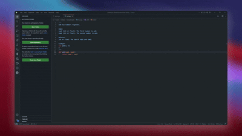
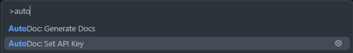
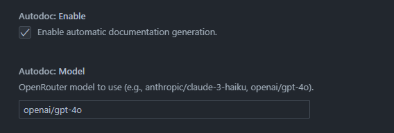

# AutoDoc Generator

AutoDoc Generator is a VSCode extension that uses AI to automatically generate documentation for your functions as you write them. It detects when you pause typing, analyzes your code, and inserts meaningful docstrings using the LLM of your choice via OpenRouter.

## Features

- **AI-Powered Documentation**: Uses OpenRouter to access models from OpenAI, Anthropic, Google, and more 
- **Automatic Detection**: Intelligently detects new functions and methods as you write them.
- **Language Support**: Works out of the box with TypeScript, JavaScript, and Python.
- **Configurable**: Choose your preferred AI model and manage your API keys securely in VSCode settings.
- **Non-Intrusive**: Runs in the background and only activates when you pause typing to avoid interrupting your flow.

## Usage

### Generating a new docstring for a function

### Changing an existing docstring when a function changes

1.  Open a supported file (TypeScript, JavaScript, Python).
2.  Write a function.
3.  The extension will automatically insert a docstring above your function.

Alternatively, you can manually trigger generation:
*   Open the Command Palette (`Ctrl+Shift+P` / `Cmd+Shift+P`)
*   Run `AutoDoc: Generate Docs`

## Requirements

You must have an **OpenRouter API Key** to use this extension.

1.  Sign up at [OpenRouter.ai](https://openrouter.ai).
2.  Create an API Key.
3.  Add it to the extension settings via pressing `f1` and typing `AutoDoc: Set API Key` 
- The API Key is stored securely on your computer via your OS's keychain (macOS Keychain, Windows Credential Manager, or Gnome Keyring).

#### Adding API key

## Extension Settings

This extension contributes the following settings:

*   `autodoc.model`: The AI model to use for generation. Defaults to `openai/gpt-4o`.
*   `autodoc.enable`: Enable/Disable the automatic generation feature.

#### Settings

## Known Issues

- Rate limiting may occur depending on your OpenRouter plan.
- Very large files may take longer to process as the extension analyzes document symbols.
- Sometimes it just doesn't work and requires you continue changing your file 

